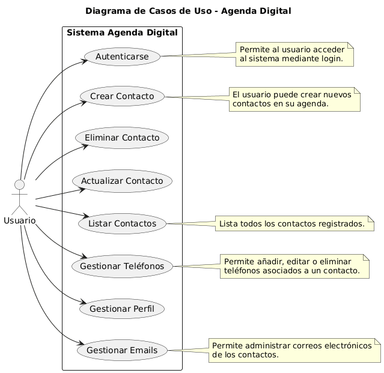
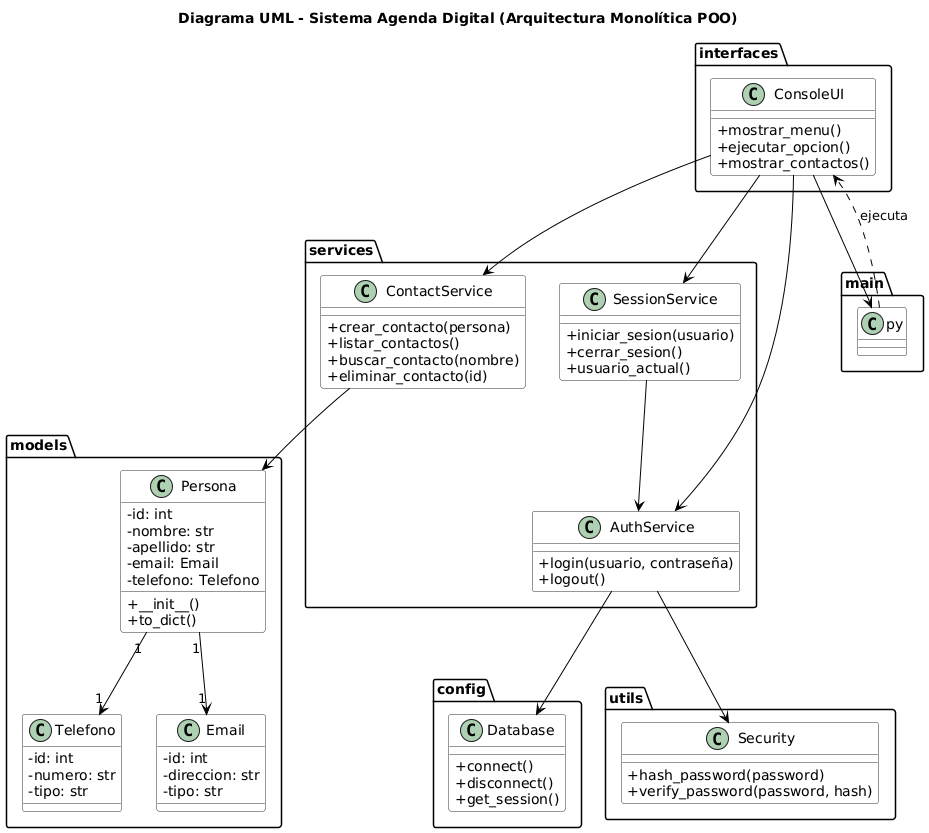

# 🗂️ Documento de Especificación de Requisitos - Agenda Digital  
**Basado en la norma ISO/IEC/IEEE 29148:2018 - Especificación de Requisitos de Software**

---

## 🎯 METADATOS DEL DOCUMENTO  

| Elemento | Valor |
|-----------|--------|
| **Identificador** | SRS-AGENDA-DIGITAL-001 |
| **Título** | Especificación de Requisitos de Software - Agenda Digital |
| **Versión** | 1.0 |
| **Fecha** | 2024 |
| **Estado** | Aprobado |
| **Clasificación** | Confidencial |
| **Normativa** | ISO/IEC/IEEE 29148:2018 |

---

## 1. INTRODUCCIÓN  

### 1.1 Propósito  
Este documento especifica los requisitos para el sistema **Agenda Digital**, una aplicación de gestión de contactos personales con autenticación segura y persistencia en base de datos relacional.

### 1.2 Alcance  
El sistema permitirá a los usuarios gestionar contactos personales mediante una interfaz de consola, con operaciones CRUD completas, autenticación segura y administración de información de contacto múltiple.

### 1.3 Definiciones, Acrónimos y Abreviaturas  

| Término | Definición |
|----------|-------------|
| **CRUD** | Create, Read, Update, Delete - Operaciones básicas de persistencia |
| **ORM** | Object-Relational Mapping - Mapeo objeto-relacional |
| **SHA-256** | Algoritmo de hash criptográfico |
| **SRS** | Software Requirements Specification |

### 1.4 Referencias  
- ISO/IEC/IEEE 29148:2018 – Ingeniería de requisitos  
- IEEE 830-1998 – Práctica recomendada para especificaciones de requisitos de software  

---

## 2. DESCRIPCIÓN GENERAL  

### 2.1 Perspectiva del Producto  
El sistema es una **aplicación monolítica** ejecutada en entorno de consola, conectada a una base de datos **MySQL** mediante SQLAlchemy ORM.

### 2.2 Funciones del Producto  
- Autenticación y gestión de usuarios  
- CRUD completo de contactos  
- Administración de teléfonos y correos asociados  
- Persistencia de datos con integridad y seguridad  

### 2.3 Características del Usuario  

| Tipo de Usuario | Características | Experiencia Técnica |
|------------------|-----------------|---------------------|
| Usuario Final | Gestiona contactos personales | Básica |
| Administrador | Primer usuario del sistema | Media |

### 2.4 Restricciones  
- Python 3.8 o superior  
- MySQL 8.0+  
- Interfaz de consola  
- Codificación UTF-8  

---

## 3. REQUISITOS ESPECÍFICOS  

### 3.1 Requisitos Funcionales  

#### RF001: Gestión de Autenticación  
- Registro del primer usuario administrador  
- Validación de credenciales  
- Contraseñas en hash **SHA-256**  
- Bloqueo tras 3 intentos fallidos  

#### RF002: Gestión de Contactos - CRUD  
- Crear, listar, actualizar y eliminar contactos  
- Buscar por nombre parcial  
- Confirmar operaciones destructivas  

#### RF003: Gestión de Información de Contacto Múltiple  
- Múltiples teléfonos y correos por contacto  
- Eliminación y visualización organizada  

#### RF004: Gestión de Perfil de Usuario  
- Visualización y edición del perfil propio  
- Gestión de correos y teléfonos personales  

---

### 3.2 Requisitos de Interfaz Externa  

#### RI001: Interfaz de Usuario  
- Interfaz de consola con menús numerados  
- Confirmaciones y mensajes descriptivos  

#### RI002: Interfaz de Base de Datos  
- ORM: SQLAlchemy 2.0+  
- DBMS: MySQL  
- Codificación UTF-8  
- Transacciones ACID  

---

### 3.3 Requisitos de Rendimiento  

| Operación | Tiempo Máximo |
|------------|---------------|
| Crear contacto | < 2 s |
| Listar contactos | < 3 s |
| Autenticación | < 1 s |
| Búsqueda | < 2 s |

---

### 3.4 Requisitos de Diseño  

| ID | Descripción |
|----|--------------|
| **RD001** | Arquitectura monolítica modular: presentación, servicios, modelos, infraestructura |
| **RD002** | Tipado estático en Python, uso de ORM y manejo de excepciones |

---

### 3.5 Requisitos de Calidad (ISO/IEC/IEEE 25010)  

| Categoría | Especificación |
|------------|----------------|
| **Fiabilidad** | Rollback ante errores, 99% disponibilidad |
| **Seguridad** | Hash de contraseñas, validación de entrada |
| **Mantenibilidad** | Modularidad, reusabilidad y trazabilidad clara |

---

## 4. ANÁLISIS DE RIESGOS  

| Riesgo | Probabilidad | Impacto | Mitigación |
|---------|--------------|----------|-------------|
| Pérdida de datos | Baja | Alto | Backup automático |
| Vulnerabilidades | Media | Alto | Hash y validación |
| Caída de BD | Baja | Alto | Reconexión automática |

---

## 5. TRAZABILIDAD DE REQUISITOS  

| Requisito | Diseño | Implementación | Prueba |
|------------|---------|----------------|--------|
| RF001 | AuthService | auth_service.py | test_auth.py |
| RF002 | ContactService | contact_service.py | test_crud.py |
| RF003 | ContactService | contact_service.py | test_relations.py |

---

## 6. GLOSARIO  

| Término | Definición |
|----------|------------|
| **Contacto** | Persona registrada en la agenda |
| **Usuario** | Persona autenticada en el sistema |
| **Sesión** | Periodo activo de usuario |
| **Transacción** | Operación atómica sobre la BD |
| **Hash** | Transformación criptográfica irreversible |

---

## 7. APROBACIONES  

| Rol | Nombre | Fecha | Firma |
|------|---------|--------|--------|
| Analista de Requisitos | [Nombre] | [Fecha] |  |
| Desarrollador Líder | [Nombre] | [Fecha] |  |
| Cliente/Usuario | [Nombre] | [Fecha] |  |
| Gerente de Proyecto | [Nombre] | [Fecha] |  |

---

## 📋 ANEXOS  

### A. Diagrama de claases

### A. Diagrama de Casos de Uso  

### A. Diagrama paquetes  

´´
=== AGENDA DIGITAL ===
1. 👤  Mi Perfil
2. 📝  Crear Nuevo Contacto
3. 📋  Listar Todos los Contactos
4. ✏️   Actualizar Contacto
5. 🗑️   Eliminar Contacto
6. 📞  Gestionar Teléfonos
7. 📧  Gestionar Emails
8. 🔒  Cerrar Sesión
9. 🚪  Salir

´´
