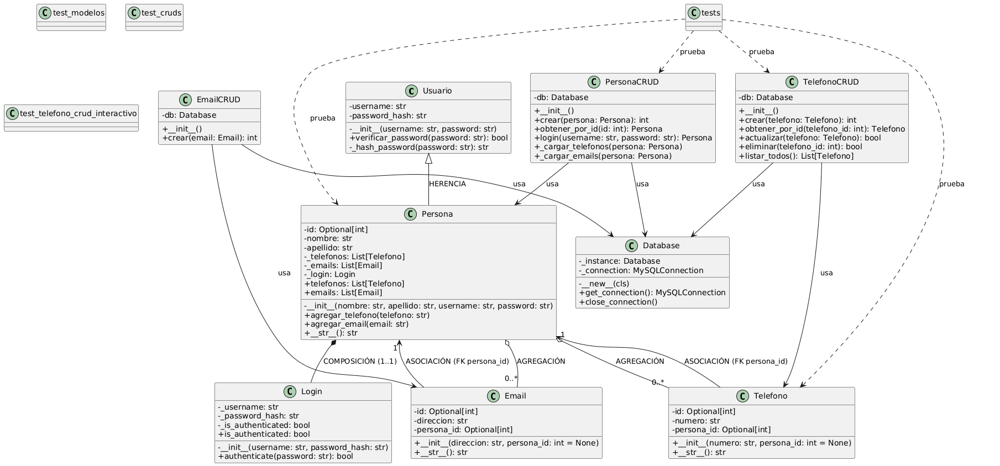
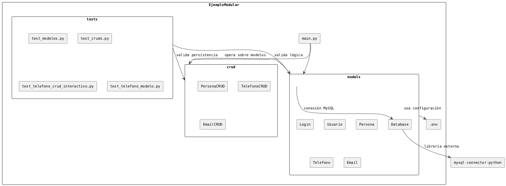

# Proyecto de Gestión de Datos
ojo instala pip install python-dotenv


Este proyecto es una aplicación sencilla que permite gestionar personas, teléfonos y correos electrónicos. Utiliza una arquitectura modular en Python que separa los modelos, las operaciones CRUD y el punto de entrada de la aplicación.

## Estructura del Proyecto

```
EjemploModular/
├── models/                 # Clases POO
│   ├── __init__.py
│   ├── database.py        # Conexión MySQL (Singleton)
│   ├── persona.py         # Clase Persona (herencia, composición)
│   ├── telefono.py        # Clase Teléfono (asociación)
│   └── email.py           # Clase Email (asociación)
│
├── crud/                   # Operaciones con base de datos
│   ├── __init__.py
│   ├── persona_crud.py    # CRUD Persona + Login
│   ├── telefono_crud.py   # CRUD Teléfono
│   └── email_crud.py      # CRUD Email
│
├── tests/                  # Pruebas unitarias
│   ├── __init__.py
│   ├── test_modelos.py    # Tests de clases POO
│   └── test_cruds.py      # Tests de operaciones CRUD
│   └── ..............     # Tests de otras  operaciones CRUD clases
│
├── .env                   # Configuración BD (CREAR MANUALMENTE)
├── main.py                # Aplicación principal (menú interactivo)
└── test_runner.py         # Ejecutor de todas las pruebas
```

## Descripción de los Componentes

### Models

Esta carpeta contiene los modelos que representan las entidades de la base de datos. Cada archivo en esta carpeta define una clase que corresponde a una tabla en la base de datos.

- `persona.py`: Define el modelo para la entidad "Persona"
- `telefono.py`: Define el modelo para la entidad "Teléfono"
- `email.py`: Define el modelo para la entidad "Email"
- `database.py`: Contiene la configuración de la base de datos y establece la conexión

### CRUD

La carpeta `crud` contiene los archivos que implementan las operaciones CRUD (Crear, Leer, Actualizar, Eliminar) para cada modelo. Cada archivo tiene funciones específicas para gestionar los registros de cada entidad.

- `persona_crud.py`: Implementa las operaciones CRUD para las personas
- `telefono_crud.py`: Implementa las operaciones CRUD para los teléfonos
- `email_crud.py`: Implementa las operaciones CRUD para los correos electrónicos

### Main

El archivo `main.py` es el punto de entrada de la aplicación. Aquí se configuran las rutas (si se usa un framework web) o se ejecutan las operaciones CRUD según sea necesario.

## Instalación

1. Clona este repositorio:

```bash
git clone https://github.com/LillianaU/AgendaORMRelacional.git
cd AgendaORMRelacional
```

2. Crea y activa un entorno virtual:

```bash
python -m venv venv

# En Windows
venv\Scripts\activate

# En Linux/Mac
source venv/bin/activate
```

3. Instala las dependencias:

```bash
pip install -r requirements.txt
```

4. Ejecuta la aplicación:

```bash
python main.py
```

## Pruebas

El proyecto incluye un conjunto completo de pruebas unitarias para verificar el correcto funcionamiento de los modelos y operaciones CRUD. Hay dos formas de ejecutar las pruebas:

### Usando pytest (Recomendado)

Pytest es un framework de pruebas más avanzado que proporciona mejor salida y funcionalidades adicionales:

```bash
# Instalar pytest si no está instalado
pip install pytest

# Ejecutar todas las pruebas
pytest tests/
```

### Usando el runner personalizado

También puedes usar el runner de pruebas incluido en el proyecto:

```bash
python test_runner.py
```

Las pruebas verifican:
- Operaciones CRUD para el modelo Persona
- Operaciones CRUD para el modelo Teléfono
- Operaciones CRUD para el modelo Email
- Validaciones de datos
- Relaciones entre modelos
- Integridad de la base de datos

# diagrama de clases


# diagrama de paquete que miestra arquitectura modular

